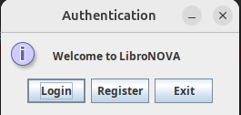
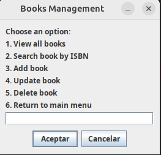
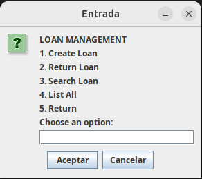

# Assesment-JAVA

## Link to the repository
https://github.com/Oomass7/Assesment-JAVA

## Coder Information
- Name: Jose Tomas Loaiza Rodriguez
- Clan: Berners Lee - JAVA
- Email: loaizarodrigueztomas@gmail.com
- Document: 102660283

## I. System Overview
This project is a library management application that allows you to add, search, update, and delete books in a database. It also manages book loans and returns.

## II. Prerequisites (Java, DB)
- Java 17
- MySQL
- MySQL Connector/J (jar available in `lib/mysql-connector-j-9.4.0.jar`)

## III. Setup and Run

### 1) Database configuration
- Create a MySQL database (example: `librarydb`).
- Ensure you have a user with permissions on that DB.
- Configure credentials in the file `src/config/database.properties` (this is loaded from the classpath at runtime):

```properties
DB_URL=jdbc:mysql://localhost:3306/librarydb?useSSL=false&serverTimezone=UTC
DB_USER=your_mysql_user
DB_PASSWORD=your_mysql_password
```

- Create the required tables in your database (books, users, loans) according to your schema. Make sure column names match those used by the DAOs (e.g., `books`: isbn, title, author, category, total_copies, copies_available, price_ref; `users`: id_user, name_user, email, password_user, rol; `loans`: id_loan, isbn, id_user, start_date, return_date, status_loan).

### 2) Build
From the project root, compile all sources to `bin/` and include the MySQL driver on the classpath:

```bash
javac -cp "lib/mysql-connector-j-9.4.0.jar" -d bin $(find src -name "*.java")
```

### 3) Run
Launch the application with the compiled classes and the MySQL driver on the classpath:

```bash
java -cp "bin:lib/mysql-connector-j-9.4.0.jar" app.Main
```

### 4) Optional: Bulk load books (CSV)
Use the "Bulk Loading" option in the UI to import a CSV with the following columns (header + rows):

```csv
isbn,title,author,category,total_copies,copies_available,price_ref
9780134685991,Effective Java,Joshua Bloch,Programming,10,10,45.50
```

Notes:
- `isbn` must be numeric.
- `copies_available` must be <= `total_copies`.
- `price_ref` is a decimal number (dot as decimal separator).

## IV. JOptionPane Screenshots
- Sign up and login


- Books management


- Loans management



## V. Use Case Diagram

